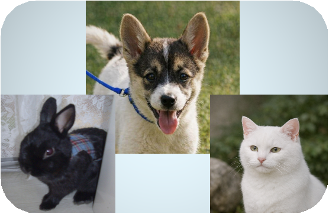
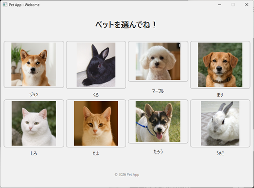
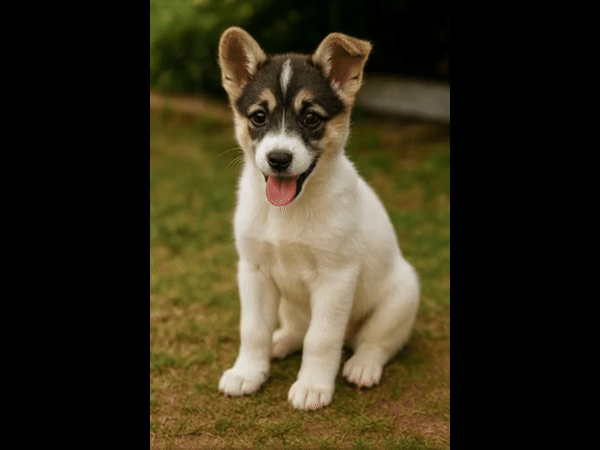

<p align="center">
  
</p>

📘 English version is available here → [README_en.md](README_en.md)

# 🐾 デスクトップペットアプリ – デモ版  
**PC があなたの笑顔や声に反応する “デスクトップペットアプリ”**  
8匹のペットがすぐに遊べる完成版デモです。

---

# 📥 セットアップ（GitHub 版・Python 必須）

この GitHub 版は **Python が必要な開発者向けバージョン**です。  
（Portable 版は Python 同梱でセットアップ不要）

---

## 1. Python をインストール（必須）

以下から **Python 3.10〜3.11** をインストールしてください：

🔗 https://www.python.org/downloads/windows/

インストール時に必ず：

- **Add Python to PATH** にチェック  
- “Install for all users” を選択（推奨）

⚠ **注意（重要）**  
- Python 3.12 が入っていても問題ありません  
- ただし本アプリは **Python 3.10〜3.11** でのみ動作します  
- create_venv.bat は PATH の python.exe を使用します  
- 必ず Python 3.10〜3.11 を追加インストールしてください

---

## 2. ZIP をダウンロード

1. このページ右上の **「Code」** をクリック  
2. **「Download ZIP」** を選択  
3. ZIP を解凍

---

## 3. ffmpeg（同梱済み）

`ffmpeg/` フォルダには以下が同梱されています：

- ffmpeg.exe  
- ffprobe.exe  

追加ダウンロードは不要です。

---

## 4. 仮想環境を作成

解凍したフォルダ内で **create_venv.bat** を実行します。

- 必要なライブラリが自動インストール  
- PyTorch（CPU版）も自動インストール  

---

## 5. アプリ起動

```
run_pet.bat
```

---

# 🌟 このアプリについて

このアプリは、  
**あなたの声・笑顔・手振りに反応する “デスクトップペット”** です。

- 8匹のペットが最初から登録済み  
- 14種類の状態（n1〜p11）を自由に切り替えて遊べる  
- Whisper による音声認識  
- カメラによる笑顔・動作検出  
- 画像・動画・音声がすべて同梱された “完成版”

---

# 🐾 登場するペット（8匹）

| 名前 | 種類 | フォルダ |
|------|------|----------|
| ジョン | 犬 | `assets/john/` |
| くろ | うさぎ | `assets/kuro/` |
| マープル | 犬 | `assets/marple/` |
| まる | 犬 | `assets/mary/` |
| しろ | 猫 | `assets/shiro/` |
| たま | 猫 | `assets/tama/` |
| たろう | 犬 | `assets/taro/` |
| うさこ | うさぎ | `assets/usako/` |

---

# 🎉 Welcome 画面



---

# 🐾 状態一覧（n1〜p11）

（あなたの表をそのまま掲載）

---

# 🎞 デモ（GIF）



---

# 📸 スクリーンショット


---

# 🗂 フォルダ構成

```
DesktopPetApp_github/
├─ assets/
├─ data/
├─ ui/
├─ core/
├─ utils/
├─ ffmpeg/
├─ desktop_pet_app.py
├─ requirements.txt
├─ create_venv.bat
├─ run_pet.bat
├─ CREDITS.md
├─ LICENSE
└─ README.md
```

---

# 🛠 技術構成

- PySide6（UI）  
- pygame（アニメーション）  
- OpenCV（カメラ検出）  
- ffmpeg（動画処理）  
- Whisper（音声認識）  
- Python 3.10+  
- GPU 不要（CPU で動作）

---

# 🖥 システム要件

- Windows 10 / 11  
- Python 3.10〜3.11  
- カメラ（Webcam）  
- マイク  
- ffmpeg 同梱  
- GPU 不要（CPU で動作）

---

# 🎉 まとめ

このアプリは、  
**8匹のペットがすぐに動く “完成版デスクトップペット”** です。

自分のペットを登録して楽しみたい場合は、  
**PetApp2 – portable / shelly / mimi / peter（User Version）** をご利用ください。
```
